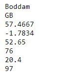
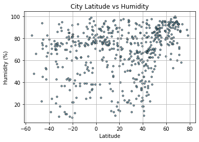
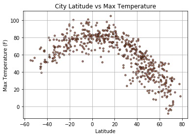
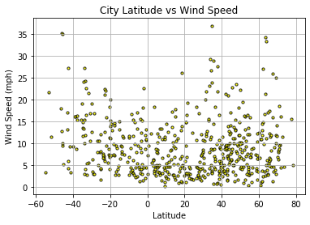
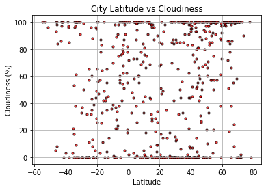

# API-Challenge

Dependencies used:
    * %matplotlib
    * Pandas
    * NumPy
    * matplotlib.pyplot
    * Requests
    * Time
    * JSON

API Data: OpenWeatherMap

## Process

    * Used starter code provided to generate random latitude/longitude coordinates
    * Created a query url appending my api key and customized units ('metric' => 'imperial')
    * Tested data retrieval with one city to ensure parameters were accurate (multiple times)

        
    
    * Ran a for loop to pull the rest of the rows (635)
        * Dropped list approach
        * Added variables and final dictionary into for loop
        * Used 'record' counter to print "Processing Record ____" to avoid disorganized output
        * Used 'try:/ except: /continue' to avoid crash when the random lat/lng coordinates do not match any cities'
        * Used "time.sleep()" to pull data every 2 seconds to avoid exceeding OWM's 60rpm limit (results in API block)
    * Converted dictionary to dataframe and sent it to a .CSV file
    * Generated 4 plots
        * Had to add limits to x & y axes

## Issues

    * API Key blocked multiple times while running data
        * Solved by using "time.sleep()" function
    * Data was being generated but not responding to my call
        * OWM changed their response keys
        * Ran additional tests before the for loop to find, correct, and add parameters to my call
    * Original method to create lists to append API data flopped--
        * All data (despite use of parameters) went into each list rather than into their respective ones
    * Needed to pass index otherwise a dataframe could not be created
        * "df = pd.DataFrame.from_dict(df)" did not work
        * used "" instead

## Analysis

    * (1) Humidity is higher in warmer cities--it barely shows in the cooler ones

        

    * (2) The max temperatures drop when in the northern coordinates contrary to the coordinates that reach the southern hemisphere

        
        
    * (3) Out of all plots, latitude coordinates affect the max temperatures
        * Wind, clouds, and humidity are directly affected by the max temperatures

        

        
